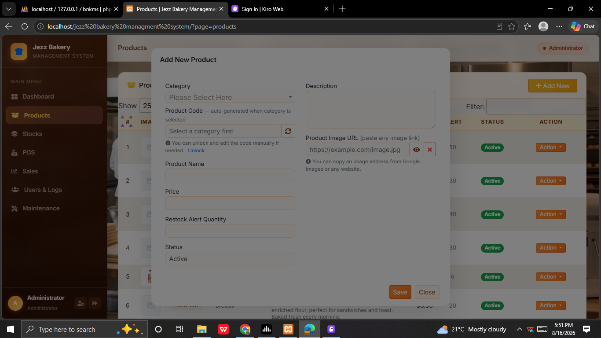

<div align="center">

# 🍞 Jezz Bakery Management System

**A warm, full-featured bakery point-of-sale and management system built with PHP & MySQL.**

[](https://php.net)
[](https://mariadb.org)
[](https://getbootstrap.com)
[](https://apachefriends.org)
[](LICENSE)

> Developed by **Bernard Mwangi** — [@ben-can-code](https://github.com/ben-can-code)
>
> 📦 Repository: [github.com/ben-can-code/jezz-bakery](https://github.com/ben-can-code/jezz-bakery)

</div>

---

## ✨ Overview

Jezz Bakery Management System is a web-based application designed for small to mid-sized bakeries. It covers product management, stock tracking, point-of-sale transactions, sales reporting, user management, and full activity/login logging — all wrapped in a warm bakery-themed UI with a real bakery wallpaper background.

---

## 🖥️ Screenshots

### 🔐 Login Page

> Role-based login with **Cashier** and **Administrator** tabs. Each tab auto-fills the correct credentials. Includes password visibility toggle and a real bakery wallpaper background.

---

### 🏠 Dashboard

> At-a-glance summary: **10 Categories**, **42 Products**, total stock count, and today's sales total. Full stock table with low-stock restock alerts highlighted in red.

---

### 📦 Products List

> Full product catalogue with image thumbnails, auto-generated category-prefixed codes (e.g. `BRD-001`, `BEV-003`), English descriptions, price, restock alert threshold, and active/inactive status.

---

### ➕ Add / Edit Product

> Clean modal form — product code **auto-generates** when a category is selected. Paste any image URL and see a **live preview** instantly. Unlock the code field to edit manually if needed.

---

### 🏪 POS — Select Products

> Cashier-facing transaction screen. Full searchable product list showing category, product code, name, unit price, and available quantity. Out-of-stock rows are highlighted.

---

### 🛒 POS — Active Cart

> Live cart panel updates as items are added. Shows quantity, product name, line total, sub-total, 12% inclusive tax, tendered amount, and change — ready to save and print.

---

### 📊 Sales Report

> Date-range filtered sales report. Lists every transaction with receipt number, item count, total amount, and the staff member who processed it. Includes a **Print** button.

---

### 🧾 Receipt

> Clean printable receipt showing transaction date, receipt number, all line items with quantities, subtotal, 12% tax, tendered amount, and change given.

---

### 👥 Users & Logs — Users Tab

> User management table with avatar initials, full name, username, role badge (Administrator / Cashier), status, and a live **actions logged** count per user. Admin account is protected.

---

### 📋 Activity Log

> System-wide activity feed. Every login, logout, create, update, and delete action is recorded with the user's name, role, action type badge, IP address, and exact timestamp.

---

### 🚨 Login Attempts

> Full login attempt history. Failed attempts highlighted in red. Captures the username entered, success/fail result, IP address, browser & device, and timestamp.

---

### 🛠️ Maintenance — Categories

> Manage the 10 bakery product categories (Breads, Cakes, Pastries, Beverages, etc.). Add new categories, edit names, toggle active/inactive, or view products per category.

---

## 🚀 Features

| Feature | Description |
|---|---|
| 🔐 Role-based login | Administrator & Cashier with tab switcher and credential hints |
| 🏪 Point of Sale | Fast product search, live cart, receipt generation |
| 📦 Product Management | Add/edit with auto-generated codes and live image preview |
| 📊 Stock Tracking | Stock levels and restock alerts per product |
| 📈 Sales Reports | Date-filtered reports with printable receipts |
| 👥 User Management | Create users — auto-generated username, admin sets password |
| 📋 Activity Log | Every action logged with user, IP, and timestamp |
| 🚨 Login Attempt Log | Tracks all login attempts, flags failures |
| 🛠️ Maintenance | Full category management with product sub-lists |
| 🎨 Warm Bakery UI | Pastel theme, real wallpaper, warm espresso sidebar |

---

## 🛠️ Tech Stack

| Layer | Technology |
|---|---|
| Backend | PHP 8.0+ |
| Database | MySQL / MariaDB via XAMPP |
| Frontend | Bootstrap 5, jQuery 3.6 |
| Tables | DataTables 1.11 |
| Dropdowns | Select2 |
| Icons | Font Awesome 6 |
| Fonts | Quicksand · Pacifico · Inter |
| Server | Apache (XAMPP) |

---

## ⚙️ Installation

### Requirements
- XAMPP (Apache + MySQL + PHP 8.0+)
- Git
- Any modern browser

### Steps

**1. Clone the repository**
```bash
git clone https://github.com/ben-can-code/jezz-bakery.git
```
Place the folder at:
```
C:\xampp\htdocs\jezz bakery managment system\
```

**2. Create the database**
- Open `http://localhost/phpmyadmin`
- Create a database named `bsms_db`
- Import `database/bsms_db.sql`

**3. Configure the database connection**

Copy `DBConnection.example.php` and rename it to `DBConnection.php`:
```php
$this->db = new mysqli('localhost', 'root', '', 'bsms_db');
```
Update host / user / password if your XAMPP config differs.

**4. Open in browser**
```
http://localhost/jezz%20bakery%20managment%20system/
```

---

## 🔑 Default Login Credentials

| Full Name | Username | Password | Role |
|---|---|---|---|
| Administrator | `admin` | `admin123` | Administrator |
| Claire Blake | `cblake` | `cblake` | Cashier |
| Mark Cooper | `mcooper` | `mcooper` | Administrator |

> Full details in [`LOGIN_INFO.txt`](LOGIN_INFO.txt)

---

## 📁 Project Structure

```
jezz bakery managment system/
├── index.php                # Main shell — sidebar, topbar, routing
├── login.php                # Login page with role tabs
├── Actions.php              # All AJAX action handlers
├── DBConnection.php         # DB connection (git-ignored)
├── DBConnection.example.php # DB connection template
├── home.php                 # Dashboard
├── products.php             # Product list with images
├── manage_product.php       # Add/Edit product form
├── users.php                # Users & Logs (3 tabs)
├── manage_user.php          # Add/Edit user form
├── sales.php                # POS / Point of Sale
├── sales_report.php         # Sales report with date filter
├── stocks.php               # Stock management
├── maintenance.php          # Category management
├── view_receipt.php         # Printable receipt
├── LOGIN_INFO.txt           # Login credentials reference
├── screenshots/             # README screenshot images
├── database/
│   ├── bsms_db.sql          # Full database dump
│   └── patch_products.sql   # Product data patch
├── css/                     # Bootstrap CSS
├── js/                      # jQuery, Bootstrap JS
├── DataTables/              # DataTables library
├── select2/                 # Select2 library
├── Font-Awesome-master/     # Icons
└── images/
    └── wallpaper.jfif       # Bakery background image
```

---

## 👨‍💻 Developer

**Bernard Mwangi**

- 🐙 GitHub: [@ben-can-code](https://github.com/ben-can-code)
- 📦 Repository: [github.com/ben-can-code/jezz-bakery](https://github.com/ben-can-code/jezz-bakery)

---

## 📄 License

This project is open source under the [MIT License](LICENSE).

---

<div align="center">
Made with 🧁 by <strong>Bernard Mwangi</strong>
</div>
