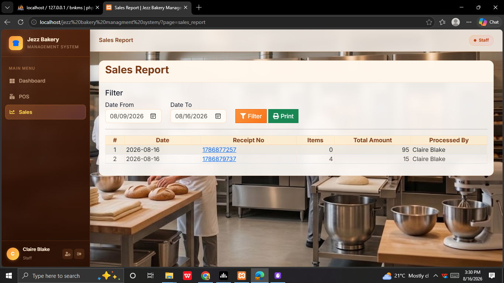

<div align="center">

# 🍞 Jezz Bakery Management System

**A warm, charming, full-featured bakery point-of-sale and management system built with PHP & MySQL.**

[](https://php.net)
[](https://mariadb.org)
[](https://getbootstrap.com)
[](https://apachefriends.org)
[](LICENSE)

> Developed by **Bernard Mwangi** — [@ben-can-code](https://github.com/ben-can-code)

</div>

---

## ✨ Overview

Jezz Bakery Management System is a web-based application designed for small to mid-sized bakeries. It covers product management, stock tracking, point-of-sale transactions, sales reporting, user management, and full activity/login logging — all in a warm bakery-themed UI with a real bakery wallpaper background.

---

## 🖥️ Screenshots

> **Note:** Add your screenshot images to the `screenshots/` folder in this repo.  
> Name them exactly as listed below and they will appear here automatically.

### 🔐 Login Page

> Charming hand-drawn style login with role tabs (Cashier / Administrator), floating bakery doodles, pastel gradient title on the real bakery wallpaper.

---

### 🏠 Dashboard

> Summary cards: Categories, Products, Total Stock, Today's Sales. Stock availability table with low-stock restock alerts.

---

### 📦 Products

> Product list with image thumbnails, auto-generated product codes, category, price, restock alert, and status badges.

---

### 🏪 Point of Sale (POS)

> Cashier-friendly transaction screen — search products, add to cart, view live totals.

---

### 🧾 POS — Live Transaction

> Cart updating in real-time with sub-total, 12% tax, tendered amount, and change calculation.

---

### 📊 Sales Report

> Date-filtered sales report showing receipt numbers, item counts, totals, and the staff member who processed each sale.

---

### 🧾 Receipt

> Clean printable receipt with transaction date, receipt number, line items, subtotal, 12% tax, tendered amount and change.

---

### 👥 Users & Logs — Users Tab

> User management with role badges, status, action count badges, and per-user activity viewer.

---

### 📋 Activity Log

> Every action logged: login, logout, create, update, delete — with user name, role, IP address, and timestamp.

---

### 🚨 Login Attempts

> Full login attempt history — failed attempts highlighted in red, browser/device detected, IP and timestamp recorded.

---

### 🛠️ Maintenance

> Category management — add, edit, delete, toggle active/inactive status.

---

## 📸 How to Add Screenshots

1. Take screenshots of each page running on your localhost
2. Save them into the `screenshots/` folder with these exact filenames:

```
screenshots/
├── login.png
├── dashboard.png
├── products.png
├── pos.png
├── pos_transaction.png
├── sales_report.png
├── receipt.png
├── users.png
├── activity_log.png
├── login_attempts.png
└── maintenance.png
```

3. `git add screenshots/` → `git commit` → `git push` — images appear in the README automatically.

---

## 🚀 Features

| Feature | Description |
|---|---|
| 🔐 Role-based login | Administrator & Cashier with different access levels |
| 🏪 Point of Sale | Fast search, cart management, receipt generation |
| 📦 Product Management | Add/edit products with auto-generated codes and image URLs |
| 📊 Stock Tracking | Stock levels, expiry dates, and restock alerts |
| 📈 Sales Reports | Date-filtered reports with printable receipts |
| 👥 User Management | Create users — auto-generated username, admin sets password |
| 📋 Activity Log | Every action logged with user, IP, and timestamp |
| 🚨 Login Attempt Log | Tracks success and failed logins |
| 🛠️ Maintenance | Category management with product sub-lists |
| 🎨 Warm Bakery UI | Pastel theme, real wallpaper background, warm sidebar |

---

## 🛠️ Tech Stack

| Layer | Technology |
|---|---|
| Backend | PHP 8.0+ |
| Database | MySQL / MariaDB (XAMPP) |
| Frontend | Bootstrap 5, jQuery 3.6 |
| Tables | DataTables 1.11 |
| Dropdowns | Select2 |
| Icons | Font Awesome 6 |
| Fonts | Inter · Pacifico · Quicksand |
| Server | Apache (XAMPP) |

---

## ⚙️ Installation

### Requirements
- XAMPP with Apache + MySQL + PHP 8.0+
- Git
- A browser

### Steps

**1. Clone**
```bash
git clone https://github.com/ben-can-code/jezz-bakery.git
```
Place the folder at:
```
C:\xampp\htdocs\jezz bakery managment system\
```

**2. Create the database**
- Open `http://localhost/phpmyadmin`
- Create database: `bsms_db`
- Import: `database/bsms_db.sql`

**3. Set up DBConnection.php**

Copy `DBConnection.example.php` → rename to `DBConnection.php`:
```php
$this->db = new mysqli('localhost', 'root', '', 'bsms_db');
```
Update host/user/password if your XAMPP is different.

**4. Open in browser**
```
http://localhost/jezz%20bakery%20managment%20system/
```

---

## 🔑 Default Login Credentials

| Full Name | Username | Password | Role |
|---|---|---|---|
| Administrator | `admin` | `admin123` | Administrator |
| Claire Blake | `cblake` | `cblake` | Cashier |
| Mark Cooper | `mcooper` | `mcooper` | Administrator |

> Full details in [`LOGIN_INFO.txt`](LOGIN_INFO.txt)

---

## 📁 Project Structure

```
jezz bakery managment system/
├── index.php                # Main shell — sidebar, topbar, routing
├── login.php                # Login page
├── Actions.php              # All AJAX action handlers
├── DBConnection.php         # DB connection (git-ignored)
├── DBConnection.example.php # DB connection template
├── home.php                 # Dashboard
├── products.php             # Product list
├── manage_product.php       # Add/Edit product form
├── users.php                # Users & Logs (3 tabs)
├── manage_user.php          # Add/Edit user form
├── sales.php                # POS / Point of Sale
├── sales_report.php         # Sales report
├── stocks.php               # Stock management
├── maintenance.php          # Category management
├── view_receipt.php         # Printable receipt
├── LOGIN_INFO.txt           # Login credentials reference
├── screenshots/             # README screenshot images
├── database/
│   ├── bsms_db.sql          # Full database dump
│   └── patch_products.sql   # Product data patch
├── css/                     # Bootstrap CSS
├── js/                      # jQuery, Bootstrap JS
├── DataTables/              # DataTables library
├── select2/                 # Select2 library
├── Font-Awesome-master/     # Icons
└── images/
    └── wallpaper.jfif       # Bakery background image
```

---

## 👨‍💻 Developer

**Bernard Mwangi**

- 🐙 GitHub: [@ben-can-code](https://github.com/ben-can-code)
- 📦 Repository: [github.com/ben-can-code/jezz-bakery](https://github.com/ben-can-code/jezz-bakery)

---

## 📄 License

This project is open source under the [MIT License](LICENSE).

---

<div align="center">
Made with 🧁 by <strong>Bernard Mwangi</strong>
</div>
